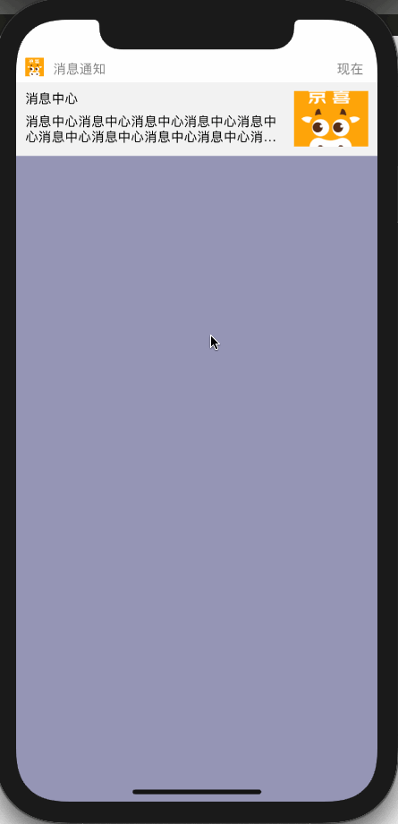

## iOS站内推送UI

### 一、功能列表：

- [x] 一行代码实现站内推送UI效果
- [x] 多次点击展示兼容
- [x] 支持点击推送UI事件
- [x] 支持显示隐藏动画及自定义展示时长
- [x] 支持拖动推送UI效果
- [x] 支持拖动超过1/3自动消失
- [x] 支持拖动小于1/3自动位置，并且展示时长重新计算


### 二、代码接入

[HDNotifPopManager.swift](https://github.com/erduoniba/HDMasterProject/blob/master/HDMasterProject/HDNotifPopView/HDNotifPopManager.swift)

```swift
private func showNotifPopView() {
    let obj = HDNotifObj()
    obj.title = "消息中心"
    obj.text = "消息中心消息中心消息中心消息中心消息中心消息中心消息中心消息中心消息中心消息中心"
    HDNotifPopManager.showNotifPopView(notif: obj) {
        debugPrint("tapHandler")
    }
}
```


### 三、效果展示

